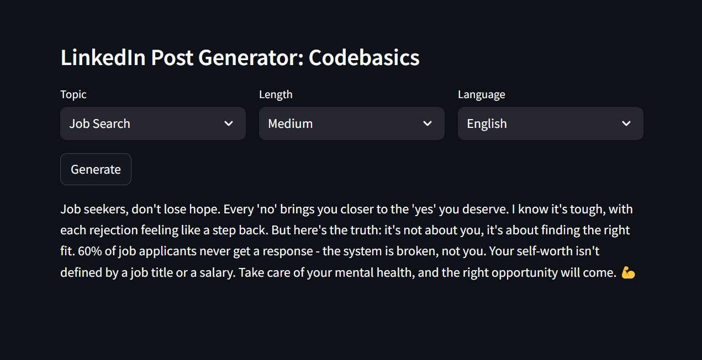

# project-genai-post-generator
This tool will analyze posts of a LinkedIn influencer and help them create the new posts based on the writing style in their old posts  



Let's say Mohan is a LinkedIn influencer and he needs help in writing his future posts. He can feed his past LinkedIn posts to this tool and it will extract key topics. Then he can select the topic, length, language etc. and use Generate button to create a new post that will match his writing style. 

## Technical Architecture


1. Stage 1: Collect LinkedIn posts and extract Topic, Language, Length etc. from it.
1. Stage 2: Now use topic, language and length to generate a new post. Some of the past posts related to that specific topic, language and length will be used for few shot learning to guide the LLM about the writing style etc.

## Set-up
1. To get started we first need to get an API_KEY from here: https://console.groq.com/keys. Inside `.env` update the value of `GROQ_API_KEY` with the API_KEY you created. 
2. To get started, first install the dependencies using:
    ```commandline
     pip install -r requirements.txt
    ```
3. Run the streamlit app:
   ```commandline
   streamlit run main.py
   ```

# 📌 Project Overview

Writing engaging LinkedIn posts regularly can be challenging for professionals, students, and content creators.

This project automates content creation using Large Language Models (LLMs) to generate high-quality LinkedIn posts in seconds.

Users simply choose:

- Topic
- Language
- Post Length

and the system generates a professional LinkedIn-ready post.

---

# ✨ Features

✔ AI-generated LinkedIn posts

✔ Topic-based generation

✔ Multiple language support

✔ Short, Medium, and Long posts

✔ Prompt Engineering

✔ Fast inference using Groq API

✔ Interactive Streamlit interface

✔ Environment variable support

✔ Easy deployment

---

# 🛠 Tech Stack

| Technology | Purpose |
|------------|---------|
| Python | Backend Development |
| Streamlit | Frontend UI |
| LangChain | LLM Integration |
| Groq API | AI Inference |
| Llama 3.3 | Language Model |
| dotenv | Environment Variables |
| GitHub | Version Control |

---

# 📂 Project Structure

```bash
linkedin-post-generator/
│
├── main.py
├── post_generator.py
├── llm_helper.py
├── few_shot.py
├── .env
├── requirements.txt
├── README.md
│
└── assets/
```

---

# ⚙️ Installation

### Clone Repository

```bash
git clone https://github.com/yourusername/linkedin-post-generator.git

cd linkedin-post-generator
```

### Create Virtual Environment

Windows

```bash
python -m venv venv

venv\Scripts\activate
```

Linux/Mac

```bash
python3 -m venv venv

source venv/bin/activate
```

---

### Install Dependencies

```bash
pip install -r requirements.txt
```

or

```bash
pip install streamlit
pip install langchain
pip install langchain-groq
pip install python-dotenv
```

---

# 🔑 Environment Variables

Create a `.env` file.

```env
GROQ_API_KEY=your_api_key_here
```

---

# 🧠 Supported Models

Recommended models:

```python
model_name="llama-3.3-70b-versatile"
```


